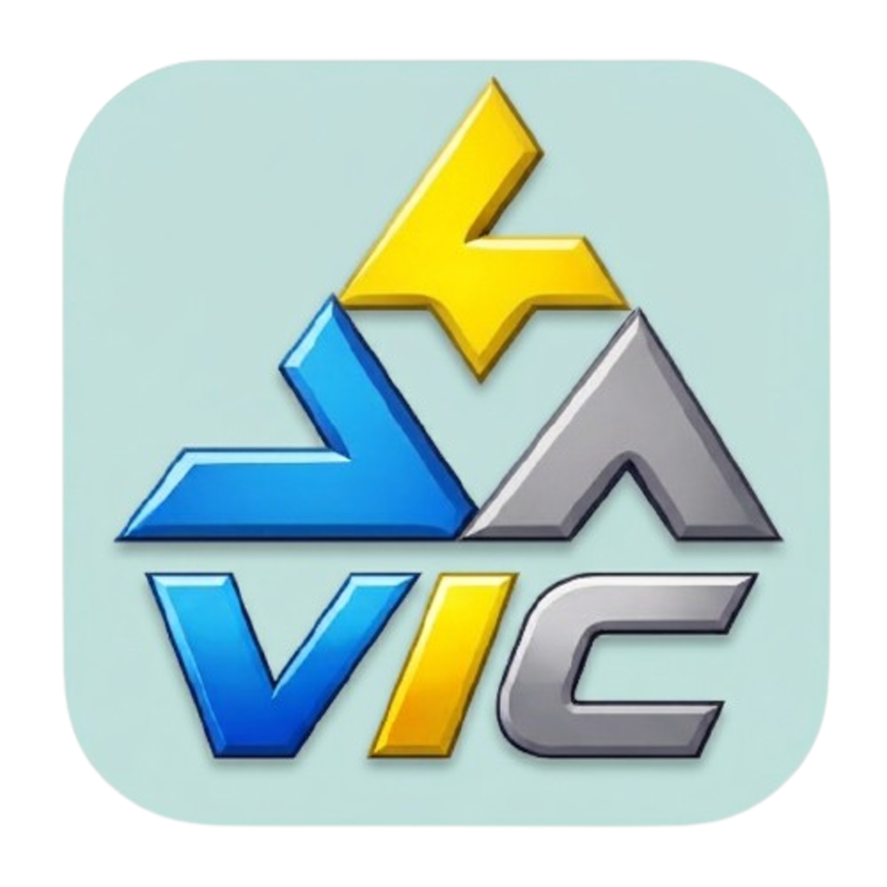

<p align="center">
  
  <h1 align="center">VillaInChat</h1>
</p>

<p align="center">
  
  
  
  
  
  
</p>

---

## 🛖 Plataforma de Comunicación para Comunidades


**VillaInChat** es una aplicación desarrollada con React Native y Expo, concebida como Proyecto Intermodular para el ciclo de Desarrollo de Aplicaciones Multiplataforma (DAM). Su objetivo principal es facilitar y centralizar la comunicación estudiantes y profesorado, ofreciendo herramientas de mensajería en tiempo real y gestión administrativa.

### ✨ Características Principales

*   💬 **Salas de Chat Privadas y de Grupo:** Comunicación instantánea y directa entre vecinos mediante WebSockets o actualizaciones en tiempo real.
*   🛡️ **Panel de Administración Restringido:** Sección exclusiva de ajustes y control (`AdminSettingsPanel`) protegida por el rol del usuario (requiere permisos de Administrador validados en base de datos).
*   ⚙️ **Ajustes y Personalización:** Menú de configuración interactivo que incluye selección de temas (Modo Claro / Oscuro) y un sistema expansible de apartados.
*   📱 **Experiencia de Usuario (UX) Nativa:** Uso de Bottom Sheets y animaciones fluidas para una navegación cómoda e intuitiva en dispositivos móviles.

<br clear="both"/>

---

## 🛠 Tecnologías y Arquitectura

### Frontend (App Móvil)

*   **Framework:** React Native + Expo (con `newArchEnabled`).
*   **Lenguaje:** TypeScript.
*   **Navegación:** `expo-router` basado en un sistema de archivos (File-based routing), estructurado en pestañas de navegación (Bottom Tabs).
*   **Formularios y Validación:** `react-hook-form` junto con su resolución semántica a través de `zod`.
*   **Gestión de Estado:** `zustand` para manejo de estados globales predictivos y Context API cuando es necesario de forma localizada.
*   **UI Adicional:** `@gorhom/bottom-sheet` para modales y `lucide-react-native` para iconografía limpia.

### Backend como Servicio (BaaS)

*   **Plataforma:** Supabase.
*   **Base de datos:** PostgreSQL con verificación a nivel de usuario y roles (como los controles dentro de la tabla `user_profile`).
*   **Autenticación:** Integración con la solución nativa de Supabase Auth.

---
## Ejecucion

### Como Usuario

* Acceda a las pagina oficial de [Villa in Chat](Villa-in-chat.vercel.app) y inicie sesion con sus credenciales o Registrese como una cuenta nueva
* Descargue la APK Movil desde este [drive](https://drive.google.com/file/d/1_afnPhfHcjCdHwaZylu92zBZKYv7VrbN/view?usp=sharing)

### Como Desarrollador

#### Si Solo Necesita la version web:
*   Descargue o copie el repositorio y haga una instalacion de dependencia
```
npm install
```
*  Y luego ejecute la aplicacion
```
npx expo start
```
#### necesito Ejecutar la version Movil
*  Puede ejecutarla mediante
```
npx expo start --tunnel
```
Aunque como aclaracion los sistemas relacionados con servicios de google no estaran activos
*  Para ejecutarla mediante una apk de desarrollo puede generarla manualmente Registrandose a [expo.dev](https://expo.dev/) y anexando el fork hecho, ACLARACION: recuerde tener las variables de entorno de su copia de la base datos y el google-services.json de su propio firebase
*  Para Generar la apk tiene que instalar en su sistema operativo no en el proyecto el Expo aplication services EAS-Cli mediante este comando
```
npm install -g eas-cli
```
*  Luego que haga el registro pertinente y cambie los archivos de configuracion en caso de que lo desee genere ya apk con
```
eas build -p android --profile preview 
```
*  posteriormente instale y ejecute el comando
```
npx expo start --dev-client
```
*  
